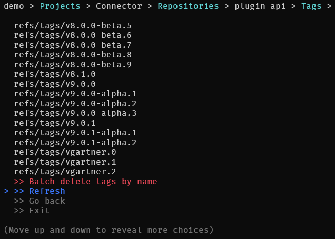

# AzdTool
[](https://www.nuget.org/packages/AzdTool/)
helps managing Azure DevOps entities.

## Installation

You can easily install as a global dotnet tool:
```
dotnet tool install --global AzdTool
```

You can then invoke the tool using the following command: `azd-tool`

## Features
For now you can:
- Browse Agent Pools, Jobs, Projects, Pipelines, Builds, Repositories, Branches, Pull-requests, Tags.
- Unit/Batch abandon Pull-requests.
- Unit/Batch cancel Jobs and Builds.
- Unit/Batch delete Branches and Tags.

It is super simple to add new features.

**Use it at your own risk !**



## Usage
```
USAGE:
    AzdTool.dll <organization> [OPTIONS] [COMMAND]

ARGUMENTS:
    <organization>    Organization

OPTIONS:
    -h, --help    Prints help information
    -p, --pat     Use a PAT instead of interactive browser credential

COMMANDS:
    browse <organization>    Browse Organization
```

## Demo

Let's say you own `foo.visualstudio.com`:

```batch
AzdTool foo
```

If you want to use a personal access token instead of using your browser for authenticating:
```batch
AzdTool foo --pat PAT
```
